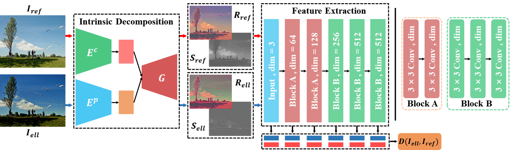
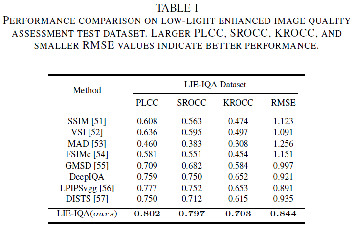
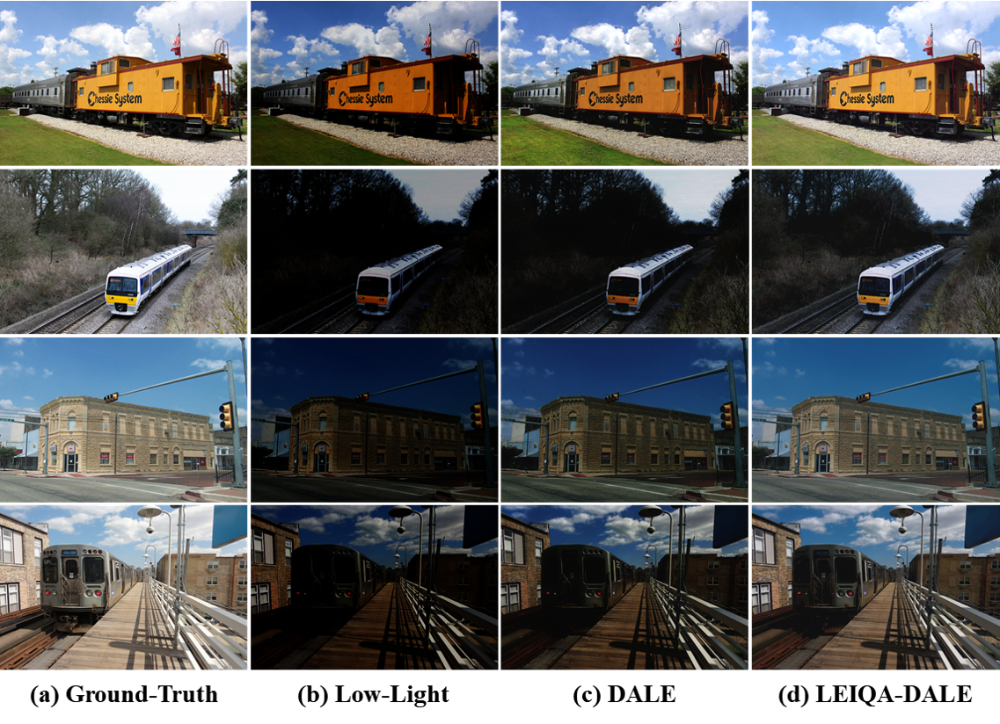
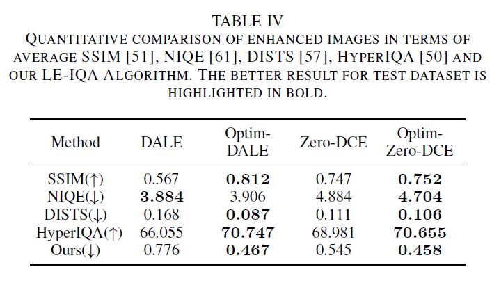

# LIE-IQA

The [Pytorch](https://pytorch.org/) implementattion of LIE-IQA. 

You can get the [MindSpore](https://www.mindspore.cn/) implementation here. It is worth noting that the MindSpore implementation of Image Intrinsic Decomposition (IID) Module is different from the Pytorch implementation , but there is not much difference in performance. Please refer to the specific code for details.

### Requirements

+ Python3
+ Pytorch 1.6
+ Torchvision
+ cuda 10.2

### Quality Assessment for Enhanced Low-light Image

+ LIE-IQA Framework

  

+ Performance on LIE-IQA Dataset

  

+ Performance on General Scene IQA Dataset
  + LIVE, MDID, CSIQ
  
  

### Quality Optimization for Low-light Image Enhancement

+ Optimization framework

  

+ Qualitative comparison of the quality optimization result

  + DALE[1]

   

+ Quantitative comparison of the quality optimization result
  + SSIM, NIQE, DISTS, hyperIQA and our LIE-IQA

  

#### References

[1]Kwon, Dokyeong, Guisik Kim, and Junseok Kwon. "DALE: Dark Region-Aware Low-light Image Enhancement." arXiv preprint arXiv:2008.12493 (2020).

