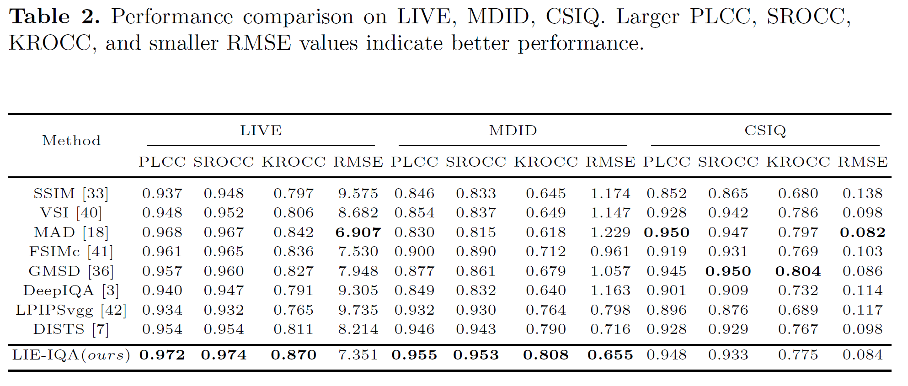
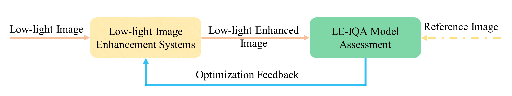
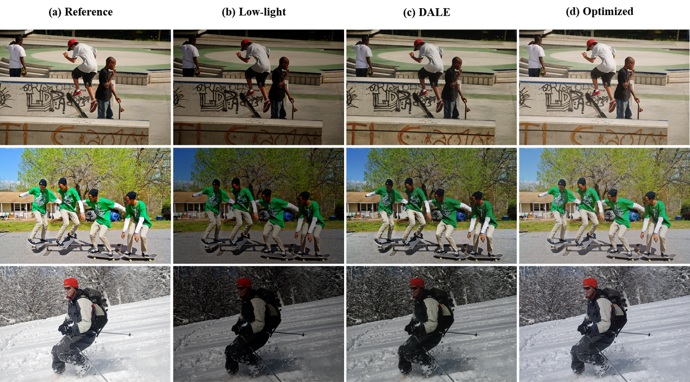

# LE-IQA
Quality Assessment for Low-light Enhanced Image

+ Performance on LE-IQA TEST dataset

  

+ Performance on IQA Dataset
  + LIVE, MDID, CSIQ
  
  
  
## Quality Optimization for Low-light Image Enhancement

+ Optimization framework

  

+ Qualitative comparison of the quality optimization result
  + Zero-DCE[1]

   

  + DALE[2]

   

+ Quantitative comparison of the quality optimization result
  + SSIM, NIQE, DISTS, hyperIQA and our LE-IQA

  

#### references
[1]Guo, Chunle, et al. "Zero-reference deep curve estimation for low-light image enhancement." Proceedings of the IEEE/CVF Conference on Computer Vision and Pattern Recognition. 2020.

[2]Kwon, Dokyeong, Guisik Kim, and Junseok Kwon. "DALE: Dark Region-Aware Low-light Image Enhancement." arXiv preprint arXiv:2008.12493 (2020).
